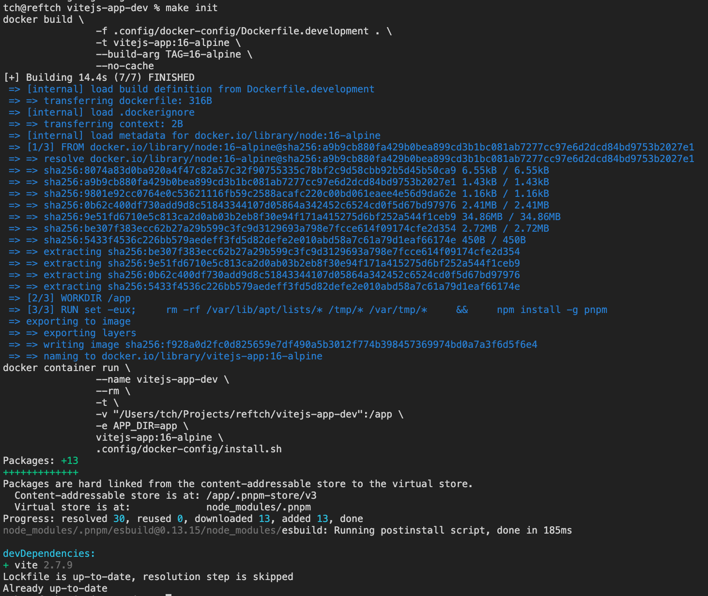
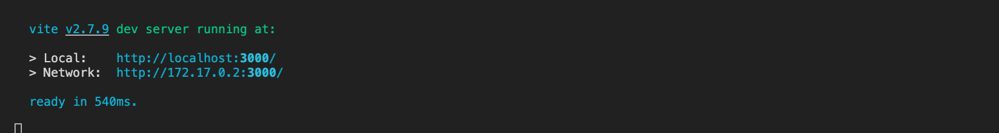

# Vite.js environment in OCI container

All you need for build and run this application to have is [Podman](https://podman.io/) or [Docker](https://www.docker.com/) installed on your computer. All necessary libraries, tools will be installed in your OCI containers on their own way.

## Quick start

1. Clone `git` repository or download the `vitejs-app-dev` repository.

```
git clone git@github.com:reftch/vitejs-app-dev.git
```  

2. Change current directory:

```
cd vitejs-app-dev
````

3. Init project environment and build container image for development.

  ```
  make init
  ```

  This step might take some seconds, because it creates an OCI container image and installs all necessary [Node.js](https://nodejs.org/en/) dependencies. For saving disk space and boosting installation speed this project applied [pnpm](https://pnpm.io/) package manager. It uses so called non-flat node_modules directory. When installing dependencies with npm, all packages are hoisted to the root of the modules directory. As a result, source code has access to dependencies that are not added as dependencies to the project. Hopefully, `pnpm` uses symlinks to add only the direct dependencies of the project into the root of the modules directory.

  

4. Start application in development container (located in the app/ dir):

  ```
  make app start
  ```

  
  
  In case if variable `PORT` from `Makefile` is the same like default **Vite.js** development server, then just navigate to `http://localhost:3000` in your browser and you will accessed to your Vite.js web application. Or just navigate to `http://localhost:PORT`, this port will be mapped from default container port to public-facing port.

  You can freely change the application's code, it will rebuilt immediately, because container has project's directories like mounted volume. This lets the con­tain­er read & write to the cur­rent direc­to­ry on our com­put­er.

  5. Stop development container:

  ````
  make app stop
  ````

  6. Make production container:

  ```
  make prod
  ```
  
  7. Create and run new container:

  ```
  make prod-start
  ```

  8. Stop production container:

  ```
  make prod-stop
  ```

  9. Remove production container:

  ```
  make prod-remove
  ```

  10. Cleanup project:

  ```
  make clean
  ```
